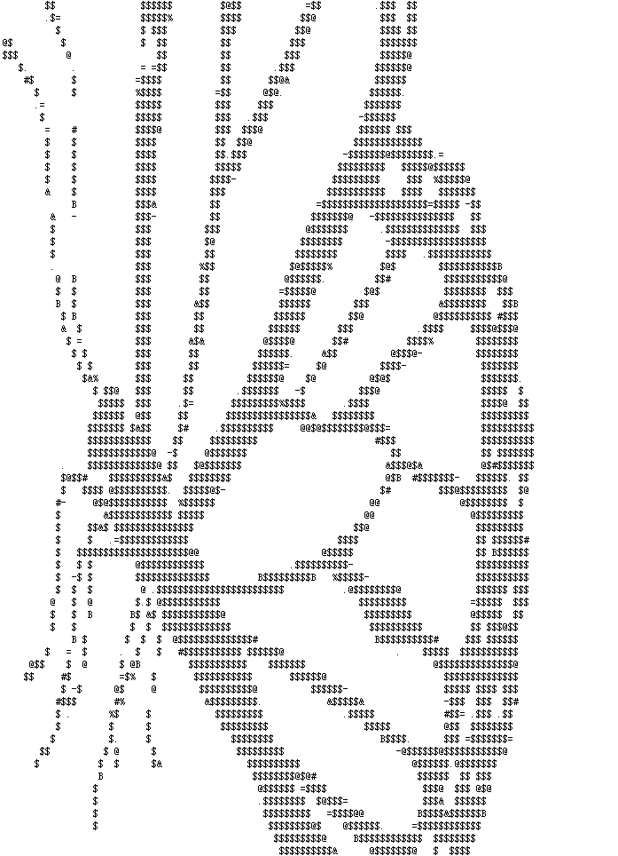

# imageToCodeEffect

有时候会遇到字符排成一副图片的样子，多见于没有表情包之前的聊天室中。  
之前感觉很神奇，美术功底太深厚了。

后来，就有了这个应用。  

实现原理很简单，只用了canvas自带的功能，没有依赖于任何第三方JS库。  
操作也很简单，上手试试就知道了（目前黑白图片效果好些，后续改进）。

后续改进：
1. 可选择用于填充的字符
2. 有一些色彩比较丰富的图片，尝试先变成灰白图片，增强对比度后再处理
3. 好看点的UI
